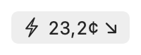
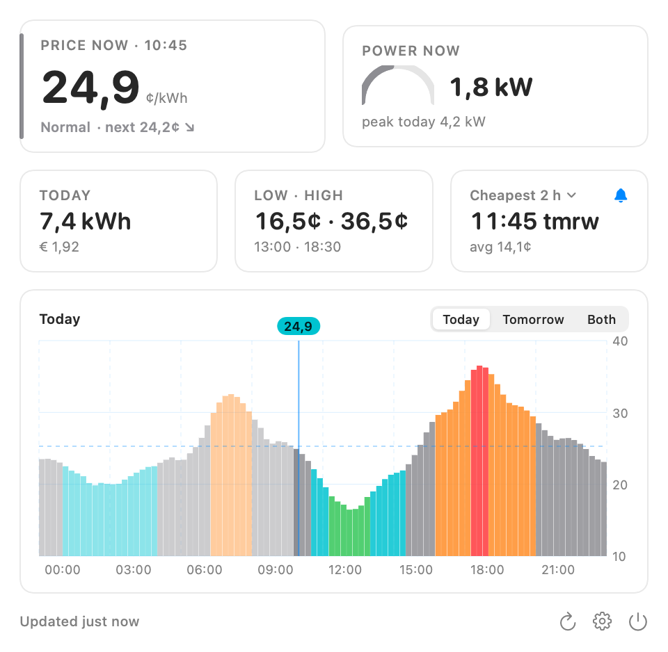

# Tibber Menu Bar

[](https://github.com/robinnewstory/tibber-menu-bar/actions/workflows/ci.yml) [](https://github.com/robinnewstory/tibber-menu-bar/releases/latest) [](LICENSE)

Your current [Tibber](https://tibber.com) electricity price, always in the macOS menu bar. Click it for a small dashboard: the price chart for today and tomorrow, the cheapest window ahead, live power from a Tibber Pulse, and notifications.

**Unofficial.** This is an independent open-source project, not affiliated with or endorsed by Tibber. It uses Tibber's public developer API with a personal access token.

<p align="center">
  <picture>
    <source srcset="docs/menubar-dark.png" media="(prefers-color-scheme: dark)">
    
  </picture>
</p>
<p align="center">
  <picture>
    <source srcset="docs/popover-dark.png" media="(prefers-color-scheme: dark)">
    
  </picture>
  <br><sub>Demo data.</sub>
</p>

Website with install instructions: **https://robinnewstory.github.io/tibber-menu-bar/**

## Install

Download the latest `Tibber-Menu-Bar.zip` from [Releases](https://github.com/robinnewstory/tibber-menu-bar/releases/latest), unzip, and drag the app into Applications. Or with Homebrew:

```sh
brew install --cask robinnewstory/tap/tibber-menu-bar
```

The app is signed but not notarized (notarization needs a paid Apple Developer membership), so macOS blocks the first launch. Open it once, click **Done**, then go to **System Settings → Privacy & Security**, scroll to *Security* and click **Open Anyway**. On macOS 14 and earlier: right-click the app → **Open**. Homebrew users can add `--no-quarantine` to skip this.

Requires macOS 14 Sonoma or later.

## Connect your Tibber account

1. Create a personal access token at <https://developer.tibber.com/settings/access-token> and copy it with the copy button.
2. Click the bolt in the menu bar → **Open Settings…**, paste the token, click **Connect**. Pick a home if you have several.

The token is stored in the macOS Keychain and only ever sent to `api.tibber.com`. The app makes no other network connections.

## Features

- **Menu bar label**: current price in cents, currency or plain; optional trend arrow, level word, the next slot's price, and live power. Bolt, level dot or no icon. Live preview in Settings.
- **Popover**: price now (with Tibber's level), live power with a gauge, today's usage and cost, low/high, the cheapest window, and the chart. Hover the chart for any slot; drag to move the price tile along, release to snap back to now. Hover the price tile for the energy and tax breakdown.
- **Solar**: when a Pulse reports export to the grid, the power tile shows the net power, the gauge turns yellow, and today's export appears next to the cost.
- **Chart**: bars, step line or area; colored by price level or single color; average line, shaded cheapest window, dimmed past, optional zero baseline; today, tomorrow or both.
- **Planner**: cheapest 1 to 6 hour window from now, shared by the tile, the chart shading and the notification.
- **Notifications**: tomorrow's prices published, cheap window about to start (10 minutes ahead), price below or above a threshold.
- **Price levels**: Tibber's own level (compared with recent days) or relative to today's average. Standard or colorblind-friendly colors.
- **Updates**: the app checks for new versions once a day through [Sparkle](https://sparkle-project.org) and installs them with one click. Settings → General → Check for Updates…
- **Offline**: last prices are cached; refresh backs off when Tibber is unreachable and the label keeps advancing through the cached slots.
- **Languages**: English, Dutch, German, Norwegian, Swedish, Danish, Finnish, French, Spanish, Italian.

## Build from source

Needs Xcode 15 or later and [XcodeGen](https://github.com/yonaskolb/XcodeGen) (unzip the release into `.tools/`, or `brew install xcodegen` and symlink it there).

```sh
cp TibberMenuBar/Config/Local.xcconfig.example TibberMenuBar/Config/Local.xcconfig   # put your Team ID in it
TibberMenuBar/build.sh            # generates the project, builds Release, installs to /Applications
TibberMenuBar/build.sh --no-install
```

A free Apple ID "Personal Team" is enough to sign a local build. Ad-hoc signing (no team) also runs, but macOS refuses notifications for ad-hoc signed apps, so the Notifications section would stay silent.

Tests for the core package: `swift test --package-path TibberMenuBar/Packages/TibberCore`.

### Layout

| Path | What |
|---|---|
| `TibberMenuBar/Packages/TibberCore` | API client, models, price math, refresh policy, planner, notification rules, live (Pulse) protocol, token store and cache. Pure Swift, tested. |
| `TibberMenuBar/App` | SwiftUI `MenuBarExtra` app: popover, chart, settings, notifications, localization glue, diagnostics. |
| `TibberMenuBar/App/Resources/Localizable.xcstrings` | String Catalog, generated by `TibberMenuBar/localize.sh` from `TibberMenuBar/Localization/translations-*.js`. |
| `TibberMenuBar/project.yml` | XcodeGen spec: sandboxed, network client entitlement, hardened runtime, `LSUIElement`. |
| `TibberMenuBar/build.sh` | Generate, build Release with a timestamp build number, install. |
| `TibberMenuBar/release.sh` | Tag, build, zip, sign for Sparkle, add to `docs/appcast.xml`, GitHub release, Homebrew cask update. |
| `TibberMenuBar/snapshots.sh` | Renders the screenshots in `docs/` from demo data. |
| `docs/` | The GitHub Pages site. |

### Diagnostics

The binary accepts a few flags and never prints the token itself:

```sh
"/Applications/Tibber Menu Bar.app/Contents/MacOS/Tibber Menu Bar" --status        # cached prices, current slot, last live reading
"/Applications/Tibber Menu Bar.app/Contents/MacOS/Tibber Menu Bar" --check-token   # verify the stored token against the API
"/Applications/Tibber Menu Bar.app/Contents/MacOS/Tibber Menu Bar" --fetch         # fetch now and update the cache
"/Applications/Tibber Menu Bar.app/Contents/MacOS/Tibber Menu Bar" --snapshot x.png [--dark] [--menubar] [-AppleLanguages "(nl)"]
"/Applications/Tibber Menu Bar.app/Contents/MacOS/Tibber Menu Bar" --check-updates  # ask the update feed, no UI
"/Applications/Tibber Menu Bar.app/Contents/MacOS/Tibber Menu Bar" --install-update # install what the feed offers, no dialogs (quit the app first)
```

### Adding a language

Add a column to one of the tables in `TibberMenuBar/Localization/` (every key needs a value; placeholders must match), run `TibberMenuBar/localize.sh`, build. The script lets `xcodebuild` extract every localizable string from the sources, so a new string in the code shows up as a missing translation until you add it.

## How it works

- **API**: `POST https://api.tibber.com/v1-beta/gql` with the bearer token, asking for `priceInfo(resolution: QUARTER_HOURLY)` (96 slots per day; hourly is selectable). Tibber reports an invalid token as HTTP 200 with an `UNAUTHENTICATED` GraphQL error.
- **Refreshing**: prices are published once a day, so the app fetches at launch, at the day rollover, and from 13:00 local time every 15 minutes until tomorrow's prices appear. A 30-second timer advances the label through cached slots; waking from sleep triggers a check.
- **Live power**: a `graphql-transport-ws` subscription to Tibber's websocket, which delivers a reading about every 10 seconds from a Pulse. Reconnects with backoff.
- **Storage**: token in the login Keychain; prices and the last live reading in the app's sandbox container; settings in `UserDefaults`.

## Releasing (maintainer notes)

Releases are built and signed on a Mac with the Personal Team certificate, because ad-hoc builds cannot deliver notifications. CI only runs the tests and an unsigned build.

```sh
TibberMenuBar/release.sh 0.2.0 "What changed"
```

This tags `v0.2.0`, builds, zips, signs the zip with the Sparkle EdDSA key from the login Keychain (tools expected under `.tools/sparkle/bin`), adds the release to `docs/appcast.xml`, creates the GitHub release with `Tibber-Menu-Bar.zip`, and bumps the Homebrew cask in a sibling `../homebrew-tap` checkout when present. The website's download button always points at the latest release; running apps pick the update up from the appcast within a day. See [CHANGELOG.md](CHANGELOG.md) and [CONTRIBUTING.md](CONTRIBUTING.md).

## License

MIT, see [LICENSE](LICENSE). Tibber and Pulse are trademarks of Tibber AS.
